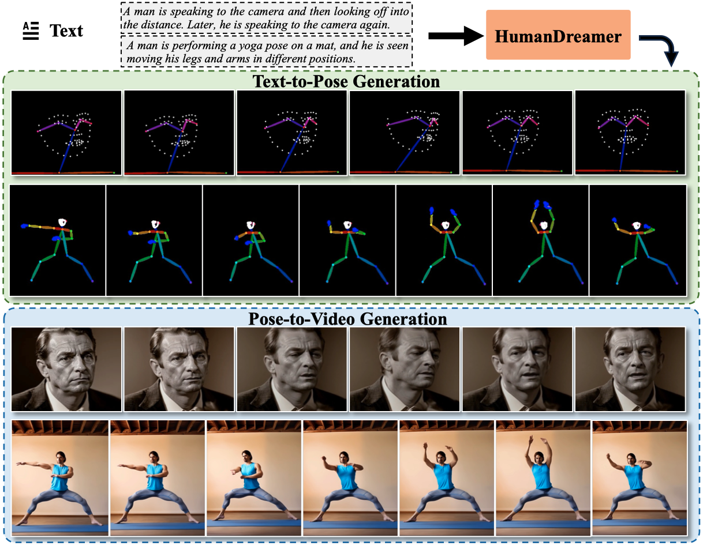
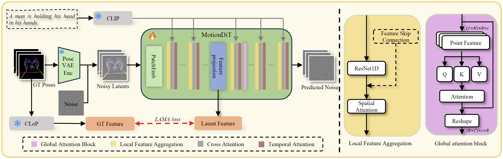
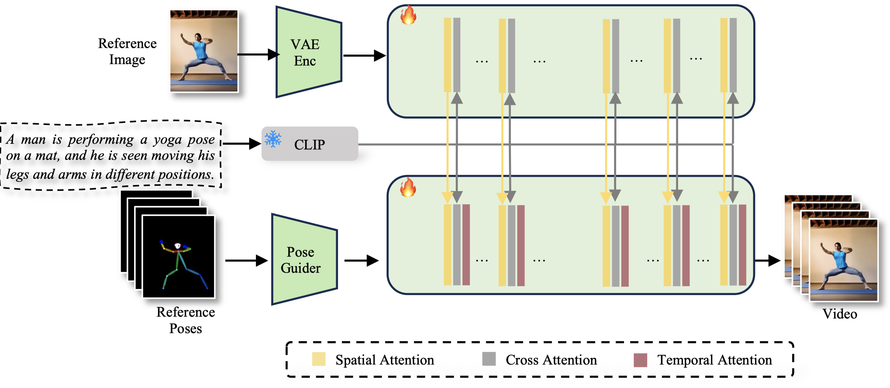

<div align="center">   
  
# HumanDreamer: Generating Controllable Human-Motion Videos via Decoupled Generation
**CVPR 2025**

</div>

 
## [Project Page](https://humandreamer.github.io/) | [Paper](https://arxiv.org/abs/2503.24026)


# News
- **[2025/4/5]** Repository Initialization.

## Abstract

Human-motion video generation has been a challenging task, primarily due to the difficulty inherent in learning human body movements. While some approaches have attempted to drive human-centric video generation explicitly through pose control, these methods typically rely on poses derived from existing videos, thereby lacking flexibility. To address this, we propose HumanDreamer, a decoupled human video generation framework that first generates diverse poses from text prompts and then leverages these poses to generate human-motion videos. Specifically, we propose MotionVid, the largest dataset for human-motion pose generation. Based on the dataset, we present MotionDiT, which is trained to generate structured human-motion poses from text prompts. Besides, a novel LAMA loss is introduced, which together contribute to a significant improvement in FID by 62.4%, along with respective enhancements in R-precision for top1, top2, and top3 by 41.8%, 26.3%, and 18.3%, thereby advancing both the Text-to-Pose control accuracy and FID metrics. Our experiments across various Pose-to-Video baselines demonstrate that the poses generated by our method can produce diverse and high-quality human-motion videos. Furthermore, our model can facilitate other downstream tasks, such as pose sequence prediction and 2D-3D motion lifting.

## Method Overview

Training pipeline of the proposed *Text-to-Pose* generation. Pose data are encoded in latent space via the Pose VAE, which are then processed by the proposed MotionDiT, where local feature aggregation and global attention are utilized to capture information from the entire pose sequence. Finally, the LAMA loss is calculated via the proposed CLoP, which enhances the training of MotionDiT.



The pipeline of *Pose-to-Video*.




## BibTeX

```bibtex
@article{wang2025humandreamer,
  title={HumanDreamer: Generating Controllable Human-Motion Videos via Decoupled Generation}, 
  author={Boyuan Wang and Xiaofeng Wang and Chaojun Ni and Guosheng Zhao and Zhiqin Yang and Zheng Zhu and Muyang Zhang and Yukun Zhou and Xinze Chen and Guan Huang and Lihong Liu and Xingang Wang},
  journal={arXiv preprint arXiv:2503.24026},
  year={2025}
}